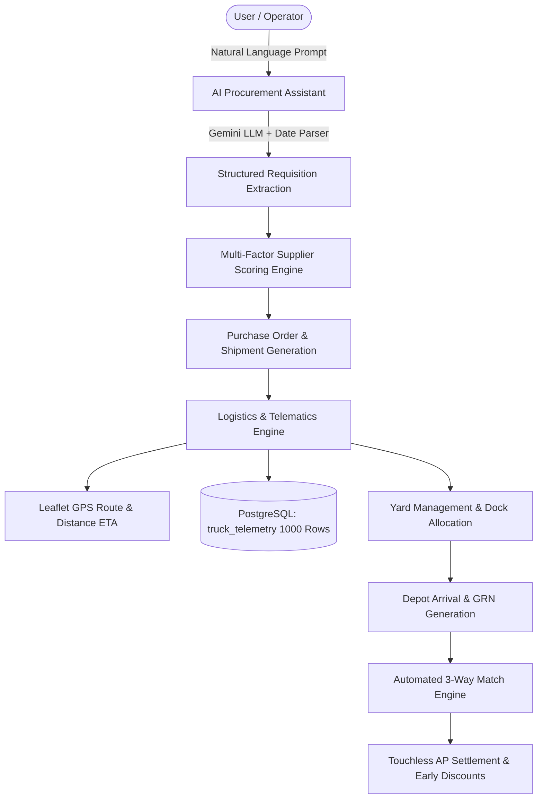

# Supply Chain Control Tower & Autonomous Orchestration Platform
## Complete Technical Architecture, Module Breakdown & Interview Defense Guide

---

## 1. Executive Summary & Project Elevator Pitch

> **"What is this project?" (30-second interview answer)**
>
> *"Our project is an end-to-end **Autonomous Supply Chain Control Tower** that unifies three traditionally disconnected enterprise silos: **Procurement (PR2)**, **Logistics Telematics (E2)**, and **Autonomous Finance / Accounts Payable (AP)**. 
>
> Using an AI-powered conversational assistant powered by Google Gemini, the platform automates requisition drafting, supplier scoring, and PO generation. As soon as an order is created, the system triggers live IoT truck dispatching with real-time GPS corridor tracking, Haversine distance-based dynamic ETA calculation, and automated warehouse yard/dock allocation. Finally, upon cargo arrival, our system conducts automated 3-Way Document Matching (PO vs. GRN vs. Invoice) to detect anomalies and capture early payment discounts—creating a truly autonomous, zero-touch supply chain pipeline."*

---

## 2. Core Technology Stack

| Layer | Technology | Purpose & Implementation Details |
| :--- | :--- | :--- |
| **Frontend UI/UX** | **Next.js (React 18, App Router)** | Modern SSR/CSR web architecture, optimized client-side routing, responsive component hierarchy. |
| **Language & Types** | **TypeScript** | Strict static typing across all API contracts, data interfaces, and UI states to prevent runtime exceptions. |
| **Styling & Design** | **Tailwind CSS & Lucide Icons** | Design tokens, curated dark/light accents, micro-interactions, responsive grid system. |
| **Mapping & GIS** | **Leaflet & React-Leaflet** | Interactive GPS map rendering, custom vehicle SVG markers, polyline route corridors, automatic bounding. |
| **Backend API** | **FastAPI (Python 3.11)** | High-throughput asynchronous REST API framework with automatic OpenAPI documentation and Pydantic v2 schemas. |
| **Database & ORM** | **PostgreSQL & SQLAlchemy 2.0** | Relational data persistence, foreign key integrity, ACID compliance, time-series IoT telemetry storage. |
| **AI / NLP Engine** | **Google Gemini (GenAI SDK)** | Context-aware natural language requisition parsing, timezone-relative date resolution, JSON entity extraction. |
| **Auth & Security** | **JWT (OAuth2) & BCrypt** | Stateless token authentication, encrypted password hashing, protected endpoint middleware. |
| **Data Pipelines** | **Custom Idempotent Python ETL** | Bulk ingestion of Smart Logistics dataset (1,000 time-series events) with deduplication keys and transactional rollbacks. |

---

## 3. High-Level System Architecture



---

## 4. Detailed Breakdown of Key Modules

### Module 1: AI Autonomous Procurement (PR2)
- **Problem Solved**: Manual procurement is slow, error-prone, and requires navigating complex ERP forms.
- **How it Works**:
  1. The user types a simple message like: *"I need 12 mobile phones for Baksa by next Tuesday."*
  2. The backend LLM pipeline parses the prompt using a dual-engine approach (Google Gemini + deterministic fallback) to extract:
     - `item_description`: *"mobile phones"*
     - `quantity`: `12`
     - `delivery_location`: *"Baksa"*
     - `required_date`: Exact calendar date for upcoming Tuesday relative to `Asia/Kolkata` timezone (`2026-08-25`).
     - `priority`: Defaults to `NORMAL` unless urgency is specified.
  3. **Multi-Factor Supplier Ranking**: Evaluates active suppliers using a weighted algorithm combining unit cost (25%), historical lead time (20%), delivery reliability score (30%), quality index (15%), and ESG sustainability rating (10%).
  4. Automatically converts approved requisitions into official **Purchase Orders (POs)**.

### Module 2: Real-Time Logistics & IoT Telematics ("Where's My Truck?" - E2)
- **Problem Solved**: Lack of real-time visibility into freight transit times, cold-chain conditions, and highway bottlenecks.
- **How it Works**:
  1. **Dynamic Route Corridor & Distance ETA**: Resolves origin and destination coordinates (e.g., Chennai DC to Balurghat) and applies the **Haversine formula** to calculate true highway driving distances and dynamic ETAs based on vehicle speed and progress.
  2. **Interactive GPS Corridor Map**: Powered by Leaflet, displaying start hubs, live animated truck positions, end destinations, and automatic viewport bounding (`MapBoundsAdjuster`).
  3. **Smart Logistics Dataset Integration**: Ingested 1,000 real time-series events across 10 fleet assets storing ambient temperature (°C), humidity (%), traffic status (Clear/Heavy/Detour), depot waiting times, and delay reasons.
  4. **Simulation Controls**: Live buttons allow dispatchers to advance vehicle positions, inject artificial traffic delays (+25 to +45 mins), or simulate the entire fleet synchronously.

### Module 3: Yard Management & Autonomous Dock Allocation
- **Problem Solved**: Warehouse bottlenecks where trucks arrive unannounced, creating depot congestion and idle driver wait times.
- **How it Works**:
  1. Geofence arrival triggers transition the vehicle status from `IN_TRANSIT` to `ARRIVED` / `IN_YARD`.
  2. The system queries warehouse dock bays (`docks` table) and evaluates compatibility:
     - Matches cargo load type (e.g., Cold-Chain Pharma vs. Heavy Inverters vs. Electronics).
     - Checks dock door availability and assigns an optimized score.
  3. Dispatches automated dock bay reservations and raises operational alerts if a dock goes under maintenance.

### Module 4: 3-Way Document Matching & Autonomous Accounts Payable (Finance)
- **Problem Solved**: Manual verification of invoices against POs and warehouse goods receipts causes multi-week payment delays and missed early-payment supplier discounts.
- **How it Works**:
  1. **OCR & Entity Cross-Referencing**: Cross-checks three records:
     - **PO (Purchase Order)**: Quantity and price authorized by procurement.
     - **GRN (Goods Receipt Note)**: Actual physical quantity received and inspected at dock.
     - **INV (Supplier Invoice)**: Total billing amount requested by vendor.
  2. **Automated Anomaly Detection**: Flags price variances, over-billing, and quantity discrepancies.
  3. **Touchless Settlement**: Clean 3-way matched invoices are cleared for straight-through processing, automatically applying vendor cash discounts (e.g., 2% Net 10 days).

---

## 5. Key Database Schema Design (PostgreSQL)

```
+-----------------------------------------------------------------------------------+
| TABLE: purchase_requests                                                          |
| id (PK), request_code, item_description, quantity, delivery_location,             |
| required_date, priority, recommended_supplier_id (FK), status, created_at         |
+-----------------------------------------------------------------------------------+
                                         |
                                         v
+-----------------------------------------------------------------------------------+
| TABLE: purchase_orders                                                            |
| id (PK), po_code, supplier_id (FK), total_amount, delivery_location, status       |
+-----------------------------------------------------------------------------------+
                                         |
                                         v
+-----------------------------------------------------------------------------------+
| TABLE: shipments                                                                  |
| id (PK), shipment_code, tracking_number, purchase_order_id (FK),                  |
| origin_location, destination_location, status, created_at                         |
+-----------------------------------------------------------------------------------+
                                         |
                                         v
+-----------------------------------------------------------------------------------+
| TABLE: trucks                                                                     |
| id (PK), truck_code, trailer_id, shipment_id (FK), driver_name, status,           |
| current_lat, current_lng, progress_percent, delay_minutes, priority,              |
| inventory_level, temperature, humidity, traffic_status, waiting_time              |
+-----------------------------------------------------------------------------------+
                                         |
                                         v
+-----------------------------------------------------------------------------------+
| TABLE: truck_telemetry (1,000 Time-Series Events)                                 |
| id (PK), truck_id (FK), source_timestamp, source_asset_id, source_latitude,       |
| source_longitude, display_latitude, display_longitude, temperature, humidity,     |
| traffic_status, waiting_time, logistics_delay_reason, asset_utilization           |
+-----------------------------------------------------------------------------------+
```

---

## 6. Likely Interview Questions & Sample Answers

### Q1: "Why did you choose FastAPI for the backend instead of standard Flask or Django?"
> **Answer**: *"We selected FastAPI for three primary reasons:
> 1. **Asynchronous Performance**: Built on top of Starlette and `uvicorn`, FastAPI handles concurrent I/O operations (such as external Gemini LLM calls and live telemetry queries) with minimal latency.
> 2. **Data Integrity via Pydantic v2**: Every request and response payload is strictly validated against schemas, eliminating type mismatches between backend and frontend.
> 3. **Automatic OpenAPI/Swagger Generation**: Provides out-of-the-box interactive API testing tools, streamlining integration across microservices."*

---

### Q2: "How did you handle the coordinates and dynamic ETA for any random city the user inputs?"
> **Answer**: *"We implemented a multi-tiered geographic resolution pipeline:
> 1. **Pan-India Coordinate Dictionary**: Covers major metropolitan distribution centers and regional hubs (Chennai, Balurghat, Baksa, Mumbai, Bengaluru, Delhi, etc.).
> 2. **Deterministic Geo-Hashing Fallback**: For any unlisted tier-2/3 town, the system generates consistent coordinates within the Indian subcontinent boundary box.
> 3. **Haversine Distance Model**: Calculates the great-circle road distance between origin and destination, models real-world highway transit speeds (45 km/h factoring terrain and checkpoints), and dynamically updates remaining ETA as progress increases or traffic delays are injected."*

---

### Q3: "How does the system prevent hallucinated or stale data during AI extraction?"
> **Answer**: *"We enforce a strict JSON schema contract with the LLM and pass the current timestamp (`Asia/Kolkata` timezone) in the system prompt. If the user mentions relative dates like 'next Tuesday', our dual-engine parser computes the exact calendar target. On the frontend, we use an atomic request sequence counter so that slow, out-of-order API responses are ignored, ensuring the UI always reflects the user's latest input."*

---

### Q4: "How did you ensure the Smart Logistics dataset import was idempotent?"
> **Answer**: *"In `import_smart_logistics.py`, we created a compound deduplication key on `(source_asset_id, source_timestamp)`. The script queries existing keys before insertion and executes inside a database transaction. Running the import script repeatedly simply skips already-ingested records and inserts 0 duplicates, ensuring production-grade data consistency."*

---

### Q5: "What makes your 3-Way Matching engine 'Autonomous'?"
> **Answer**: *"In traditional ERPs, human clerks manually reconcile paper invoices against warehouse receipts. Our engine cross-references the PO amount and quantity against the GRN verified count and OCR-extracted invoice lines. If all variances fall within a 0% tolerance threshold, the payment record is automatically created and queued for settlement with early discount capture—only routing to human review when an explicit anomaly (e.g. price variance or damaged units) is detected."*

---

## 7. Quick Summary Checklist for Tomorrow

- [x] **Elevator Pitch**: Autonomous Control Tower connecting Procurement, Live Fleet Logistics, and Finance.
- [x] **AI**: Gemini LLM + Timezone-aware entity parser for zero-touch requisitioning.
- [x] **Logistics**: Haversine distance-based dynamic ETA, Leaflet GIS auto-bounding, 1,000-row telemetry dataset with cold-chain sensor ribbon.
- [x] **Yard & Docks**: Automated dock allocation matching vehicle cargo to compatible bay doors.
- [x] **Finance**: 3-Way Match (PO vs. GRN vs. INV) with automated anomaly flagging.
- [x] **Database**: Clean PostgreSQL schema with foreign keys, indexes, and idempotent bootstrapping.
